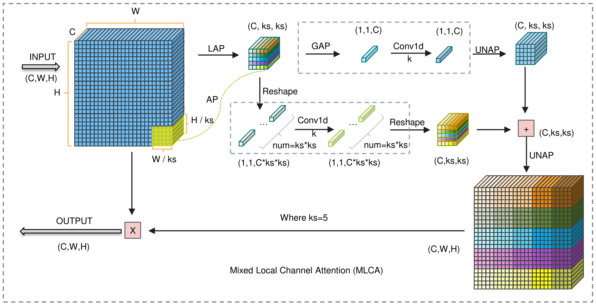
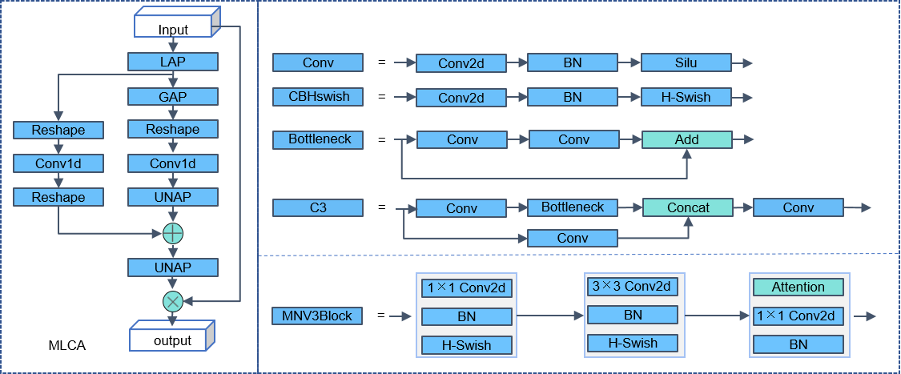

# Mixed Local Channel Attention for Object Detection

## 简介
本项目介绍了一种轻量级的 Mixed Local Channel Attention (MLCA) 模块，该模块同时考虑通道信息和空间信息，并结合局部信息和全局信息以提高网络的表达效果。基于该模块，我们提出了 MobileNet-Attention-YOLO(MAY) 算法，用于比较各种注意力模块的性能。在 Pascal VOC 和 SMID 数据集上，MLCA 相对于其他注意力技术更好地平衡了模型表示效果、性能和复杂度。与 PASCAL VOC 数据集上的 Squeeze-and-Excitation(SE) 注意力机制和 SIMD 数据集上的 Coordinate Attention(CA) 方法相比，mAP 分别提高了 1.0% 和 1.5%。

## 论文链接
- [Mixed Local Channel Attention for Object Detection](https://www.sciencedirect.com/science/article/abs/pii/S0952197623006267)

## 中文解读链接
- [Mixed Local Channel Attention中文解读](中文解读链接) [TODO: 如有需要，会在后面编写并更新]

## 视频教程链接
- [Mixed Local Channel Attention 视频解读和二次创新方案](https://www.bilibili.com/video/BV1ju4y1c7ww/) 

## 二次创新点梳理和代码实现（TODO）

## 引用格式
如果项目和文章对您有所帮助，请引用以下论文：

@article{WAN2023106442,
title = {Mixed local channel attention for object detection},
journal = {Engineering Applications of Artificial Intelligence},
volume = {123},
pages = {106442},
year = {2023},
issn = {0952-1976},
doi = {https://doi.org/10.1016/j.engappai.2023.106442},
url = {https://www.sciencedirect.com/science/article/pii/S0952197623006267},
author = {Dahang Wan and Rongsheng Lu and Siyuan Shen and Ting Xu and Xianli Lang and Zhijie Ren},
}

例如：

D. Wan, R. Lu, S. Shen, T. Xu, X. Lang, Z. Ren. (2023). Mixed local channel attention for object detection. Engineering Applications of Artificial Intelligence, 123, 106442.
## 参考链接
- [整体框架使用代码：YOLOv5](https://github.com/ultralytics/yolov5)
- [GradCAM可视化部分和部分模块参考代码](https://github.com/z1069614715/objectdetection_script)
- [ECA](https://github.com/BangguWu/ECANet)
- [SqueezeNet](https://github.com/DeepScale/SqueezeNet)
- [GradCAM可视化部分视频教程（无需改动源码）（YOLOv5,YOLOv7,YOLOv8）](https://www.bilibili.com/video/BV1WP4y1v7gQ/)
- [GradCAM原理讲解视频]( https://www.bilibili.com/video/BV1PD4y1B77q/)

## 结尾
感谢您对本项目的关注和支持。作者尽力提供最好的质量和服务，但仍然有很多需要改进之处。如果您发现任何问题或有任何建议，请告诉我。
另外，本项目目前由我个人维护，难免存在疏漏和错误。如果您发现了任何问题，欢迎提出建议和意见。

## 其他开源项目
其余开源项目陆续在整理发布，后续请查看作者主页进行下载
[主页](https://github.com/wandahangFY)

## 相关问题解答
1. README.md 文件添加 （已完成）  
2. 热力图可视化部分 文件添加，yolo-gradcam （已完成，搬运的 objectdetection_script 开源项目，在链接内有详细教程，将yolov5_headmap.py放在根目录即可正常使用，YOLOv7和YOLOv8同理）
3. 项目环境配置（MLCA模块是即插即用的,整个项目是YOLOv5-6.1版本，配置参考README-YOLOv5.md文件和requirements.txt）
4. 文件夹对应说明（与YOLOv5-6.1保持一致，未改变超参数）（TODO：详细说明 ）
5. 二次创新点梳理和代码实现（TODO）
6. 论文作图（期刊版权问题，不提供ppt源文件，见谅）：
   - 原理图，网络结构图，流程图：PPT （根据个人选择，也可以使用Visio，亿图，AI等）
   - 实验对比：Orgin（matlab,python,R,Excel都可以）